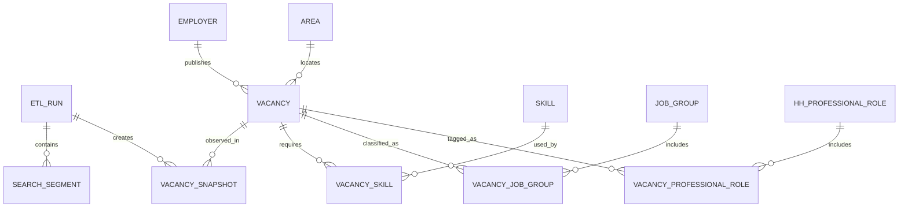

# Упрощённая ER-модель

```mermaid
erDiagram
    ETL_RUN ||--o{ SEARCH_SEGMENT : contains
    ETL_RUN ||--o{ VACANCY_SNAPSHOT : creates
    VACANCY ||--o{ VACANCY_SNAPSHOT : observed_in
    EMPLOYER ||--o{ VACANCY : publishes
    AREA ||--o{ VACANCY : locates
    VACANCY ||--o{ VACANCY_SKILL : requires
    SKILL ||--o{ VACANCY_SKILL : used_by
    VACANCY ||--o{ VACANCY_JOB_GROUP : classified_as
    JOB_GROUP ||--o{ VACANCY_JOB_GROUP : includes
    VACANCY ||--o{ VACANCY_PROFESSIONAL_ROLE : tagged_as
    HH_PROFESSIONAL_ROLE ||--o{ VACANCY_PROFESSIONAL_ROLE : includes
```

Физические имена таблиц и ограничения находятся в `sql/ddl`.
